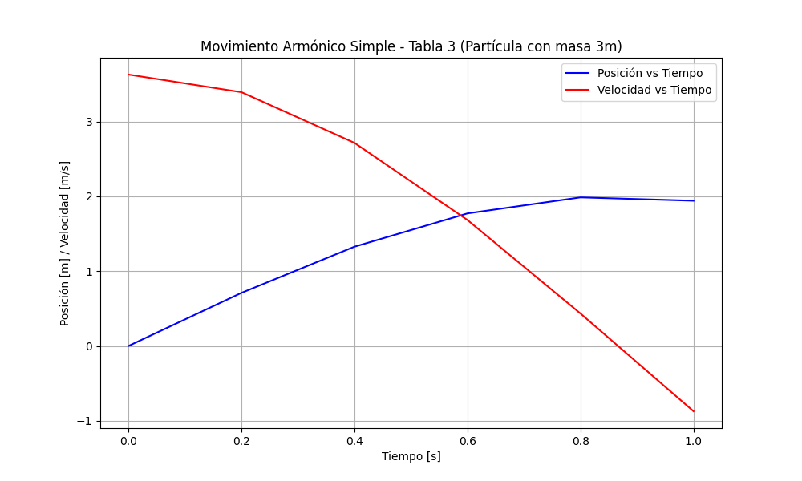

## Tabla 3: Partícula con masa 3m

### Datos experimentales:
Los datos de posición y velocidad de la partícula con masa 3m a distintos tiempos son los siguientes:

| t[s]   | x[m]   | v[m/s] |
|--------|--------|--------|
| 0.000  | 0.000  | 3.628  |
| 0.200  | 0.710  | 3.392  |
| 0.400  | 1.327  | 2.714  |
| 0.600  | 1.772  | 1.683  |
| 0.800  | 1.986  | 0.433  |
| 1.000  | 1.941  | -0.873 |

### Análisis de los datos:

- *Posición (x)*: La partícula comienza en la posición de equilibrio (0.000 m) y se desplaza a la derecha a medida que aumenta el tiempo, alcanzando posiciones más altas.
- *Velocidad (v)*: La velocidad es positiva cuando la partícula se mueve hacia la derecha y se reduce conforme se aproxima a la posición extrema.
- A medida que la partícula se aleja de la posición de equilibrio, la velocidad disminuye y cambia de dirección al llegar a la máxima distancia.

### Gráfico de Posición vs Tiempo y Velocidad vs Tiempo

### Conclusión:
El gráfico muestra cómo la partícula oscila en su trayectoria, con su velocidad disminuyendo a medida que se aleja de la posición de equilibrio. Es un claro ejemplo de un movimiento armónico simple con oscilaciones de ida y vuelta.